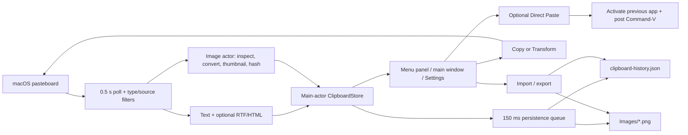

# CopyClip Lite Functional Audit and Remediation Plan

Audit date: 2026-07-26
Audited commit: `db0a3d3de6f72b6e721d9025710bc6271efd3a65` (`main`)
Scope: product behavior, functional correctness, reliability, data integrity, UX, performance, test coverage, packaging, and release readiness
Explicit exclusion: security and vulnerability auditing

Implementation follow-up: see `COPYCLIP_LITE_IMPLEMENTATION_REPORT.md` for the completed remediation status, verification evidence, and the remaining publication/manual-integration gates. Apple Developer signing and notarization are explicitly outside the selected release scope.

## Executive conclusion

CopyClip Lite is a coherent native macOS clipboard manager with a solid basic feature set and a reasonably clean small-codebase architecture. It compiles cleanly under strict Swift concurrency checks, all 33 current tests pass, and the staged app is a valid universal macOS binary.

It is not ready to be treated as data-safe or release-ready yet.

The highest-risk findings are:

1. Retained images captured during the current launch can lose their on-disk image files after deleting another clip, clearing while keeping pinned clips, or clearing unpinned clips on quit.
2. A queued pre-import persistence snapshot can overwrite a completed import after the UI reports success.
3. Image sidecars and the JSON manifest are not committed as one transaction; failure paths can corrupt the relationship between them.
4. “Clear unpinned history on quit” can delete pinned clips because it incorrectly reuses the manual-clear preference.
5. The update feature and release pipeline are not operational in the repository’s current state: the repository is private, there are no releases/tags, and the only GitHub Actions run was blocked before execution by account billing/spending limits.

These should be fixed before polish work or feature expansion.

## How the audit was performed

The primary audit mapped the repository, read every Swift source, test, script, and workflow, then ran:

- `swift test`
- `swift build -Xswiftc -strict-concurrency=complete -Xswiftc -warnings-as-errors`
- universal release build and binary inspection
- shell syntax checks for all scripts
- staged app plist, code-signature, architecture, and ZIP validation
- GitHub repository, release, tag, and Actions state checks

Seven read-only subagents were given separate, explicit non-security goals:

1. Product behavior and implementation-scope audit
2. Clipboard store, persistence, retention, import/export, and data-correctness audit
3. SwiftUI, lifecycle, onboarding, keyboard, focus, and accessibility audit
4. Global hotkey, recorder, target selection, and Direct Paste audit
5. Image capture, decoding, persistence, transfer, and performance audit
6. Login item, updater, packaging, CI, and release audit
7. Independent build, test, coverage, and untested-path audit

Their findings were cross-checked and deduplicated below.

## What the app does

### Runtime and presentation

- Requires macOS 14 or later.
- Runs as an accessory/menu-bar app with no Dock icon.
- Presents a `MenuBarExtra` clipboard panel and a separate main window using the same panel view.
- Shows a first-run welcome screen.
- Migrates selected preferences from the former `com.local.CopyClipLite` bundle identifier.
- Can register itself as a Launch at Login item.

Primary implementation:

- `Sources/CopyClipLite/App/CopyClipLiteApp.swift`
- `Sources/CopyClipLite/Views/RootWindowView.swift`
- `Sources/CopyClipLite/Views/WelcomeView.swift`
- `Sources/CopyClipLite/Services/LoginItemController.swift`

### Clipboard monitoring and capture

- Polls `NSPasteboard.general` every 0.5 seconds.
- Captures plain text.
- Preserves RTF and HTML representations when a plain-string flavor is also present.
- Captures PNG and TIFF image representations.
- Converts TIFF to PNG and generates a small thumbnail.
- Applies text and image size/dimension limits.
- Skips pasteboard content marked transient, concealed, or auto-generated.
- Associates a best-effort source application with a captured clip.
- Supports an application exclusion list.
- Supports manual pause and timed pauses.

Primary implementation:

- `Sources/CopyClipLite/Stores/ClipboardStore.swift`
- `Sources/CopyClipLite/Services/ClipboardImageProcessor.swift`
- `Sources/CopyClipLite/Models/ClipboardSourceApplication.swift`

### History model

Each clip may contain:

- UUID
- text
- text or image content kind
- PNG image payload/file reference
- thumbnail payload/file reference
- RTF and HTML data
- created and last-copied timestamps
- pin state
- copy count
- source application

Repeated text is intended to deduplicate by text. Repeated images are intended to deduplicate by image hash. Reused clips move to the top by recency.

Primary implementation:

- `Sources/CopyClipLite/Models/ClipboardItem.swift`
- `Sources/CopyClipLite/Stores/ClipboardStore.swift`

### Persistence and retention

- Stores the history manifest as JSON under Application Support.
- Externalizes full images and thumbnails into an `Images` directory.
- Defaults to 50 unpinned clips, configurable from 10 to 200.
- Defaults to seven-day retention for unpinned clips.
- Keeps pinned clips outside the unpinned count limit.
- Can keep or remove pinned clips during manual Clear.
- Can clear history on quit.
- Debounces normal persistence by 150 ms.

Primary implementation:

- `Sources/CopyClipLite/Services/ClipboardStorage.swift`
- `Sources/CopyClipLite/Stores/ClipboardStore.swift`

### Finding and using clips

- Searches text, image metadata, and source-application name.
- Filters by All, Text, Images, or Pinned.
- Visually groups pinned clips above recent unpinned clips.
- Supports row click, context menus, pin, delete, and clear.
- Advertises arrow navigation, Return, P, Delete, and Command-F controls.
- Copies text back with optional RTF/HTML.
- Copies images back as PNG and eagerly creates a TIFF representation.
- Offers uppercase, lowercase, title-case, and “Strip Formatting” transformations.

Primary implementation:

- `Sources/CopyClipLite/Views/ClipboardPanelView.swift`
- `Sources/CopyClipLite/Views/ClipboardPanelKeyboardBridge.swift`
- `Sources/CopyClipLite/Views/ClipboardItemRow.swift`
- `Sources/CopyClipLite/Models/TextTransformation.swift`

### Hotkey and Direct Paste

- Registers a configurable Carbon global hotkey, defaulting to Option-Command-V.
- Opens the main clipboard window and focuses search.
- Optionally copies a clip, hides CopyClip Lite, activates the last external application, and posts Command-V.
- Requests Accessibility permission only for Direct Paste.

Primary implementation:

- `Sources/CopyClipLite/Services/GlobalHotkeyController.swift`
- `Sources/CopyClipLite/Views/HotkeyRecorder.swift`
- `Sources/CopyClipLite/Services/PasteTargetController.swift`
- `Sources/CopyClipLite/Services/PasteSimulator.swift`

### Import, export, updates, and release

- Exports portable JSON with embedded image and thumbnail bytes.
- Reads an import twice: once for preview and again when applying it.
- Supports merge or replace.
- Creates a portable pre-import backup.
- Checks the hard-coded GitHub repository’s latest release endpoint.
- Builds an app bundle through SwiftPM and shell scripts.
- Has CI and tagged-release GitHub Actions workflows.

Primary implementation:

- `Sources/CopyClipLite/Services/ClipboardTransferPanels.swift`
- `Sources/CopyClipLite/Services/ClipboardStorage.swift`
- `Sources/CopyClipLite/Views/SettingsView.swift`
- `Sources/CopyClipLite/Services/UpdateChecker.swift`
- `script/*.sh`
- `.github/workflows/*.yml`

## System data flow

The most serious defects sit at the boundaries between the main-actor store, delayed persistence, and external image files.

## Verification results

| Check | Result |
|---|---|
| Unit tests | 33 passed, 0 failed |
| Strict concurrency build with warnings as errors | Passed |
| Shell syntax for three scripts | Passed |
| Current universal release executable | `arm64` + `x86_64` |
| Staged plist | Valid |
| Staged code signature | Valid for the staged build |
| Release ZIP integrity | Passed `unzip -tq` |
| Staged version | `1.0.0` build `10` |
| Git history length | 11 commits |
| GitHub tags | None |
| GitHub releases | None |
| Repository visibility | Private |
| GitHub Actions | Only run failed before job start due billing/spending limit |

Coverage was measured from the current test suite:

- Total executable line coverage: approximately 25.15%
- Total function coverage: approximately 26.74%
- `ClipboardStorage`: approximately 81.34% line coverage
- `ClipboardStore`: approximately 73.51% line coverage
- App lifecycle, hotkey config/controller, transfer panels, login item, Paste Simulator, Paste Target, updater, all SwiftUI views, and the keyboard bridge: effectively 0%

Passing tests therefore do not cover most of the user-facing failure paths identified here.

## Priority definitions

- **P0 — Release blocker:** credible data loss/corruption or a currently nonfunctional release-critical capability.
- **P1 — Core correctness:** breaks a primary workflow, can disable the app, or causes severe responsiveness/reliability failures.
- **P2 — Important:** meaningful correctness, compatibility, or UX problem with narrower impact.
- **P3 — Polish/scope:** lower-risk refinement, accessibility, maintainability, or explicit product-scope decision.

## Numbered remediation backlog

### TASK-001 — Stop successful cleanup from deleting retained live-captured image files

Priority: P0
Confidence: Confirmed by direct value-semantics/control-flow analysis

Evidence:

- `ClipboardImageProcessor.swift:92-99` returns inline full and thumbnail data with no filenames.
- `ClipboardStore.swift:547-575` inserts that inline payload into live `items`.
- `ClipboardStore.swift:759-788` persists a snapshot but never replaces live items with externalized records.
- `ClipboardStorage.swift:111-122,243-275` externalizes only a local value copy.
- `ClipboardStore.swift:366-380,486-500` performs a second cleanup using the still-inline live items.
- `ClipboardStorage.swift:332-345` considers only filenames referenced; inline retained images have none.

Failure:

A successful flush writes JSON that references newly created `<uuid>.png` files. The subsequent caller-side cleanup sees no filename on the retained live record and deletes those same files. This affects:

- deleting another clip while a newly captured image remains;
- Clear while keeping a newly captured pinned image;
- clear-unpinned-on-quit while keeping a newly captured pinned image.

After restart, the JSON record remains but copy/display fails because its files are gone.

Implementation:

- Remove redundant caller-side `removeUnreferencedImageFiles` calls.
- Make cleanup an internal part of a successful storage commit.
- Do not allow callers to clean against a representation different from the persisted manifest.

Acceptance criteria:

- All three scenarios above retain full and thumbnail files.
- Reloaded storage can read and copy every retained image.
- Files belonging only to removed clips are deleted.
- Add regression tests using a live-captured inline image, not only preloaded file-backed images.

### TASK-002 — Serialize import with pending persistence

Priority: P0
Confidence: Confirmed

Evidence:

- `ClipboardStore.swift:759-774` captures an old snapshot and schedules it 150 ms later.
- `ClipboardStore.swift:267-284` imports without cancelling, flushing, or generation-checking that work item.
- Export explicitly flushes at `ClipboardStore.swift:258-260`; import does not.

Failure:

A mutation immediately before Import can leave an old work item queued. Import saves and reloads the new state, reports success, then the old work item overwrites disk. In-memory state and disk disagree until restart; imported image files can also be removed by stale cleanup.

Implementation:

- Route normal saves and import through one transaction coordinator.
- Before backup/apply, cancel and synchronously drain pending persistence.
- Add a monotonically increasing persistence generation so stale tasks cannot commit.
- Make import’s backup represent the actual immediately pre-import committed state.

Acceptance criteria:

- Merge and Replace remain durable after waiting beyond the debounce interval and relaunching.
- Disk and live items are identical after import.
- Imported images remain copyable.
- Deterministic tests reproduce the old ordering and prove it cannot recur.

### TASK-003 — Make manifest and image-sidecar persistence transactional

Priority: P0
Confidence: High

Evidence:

- `ClipboardStorage.swift:115-121` writes/overwrites image files before the JSON manifest.
- Filenames are deterministic and commonly UUID-based at `ClipboardStorage.swift:252-270`.
- Manifest failure occurs after sidecar writes.
- `ClipboardStore.flushPendingPersist` swallows errors at `ClipboardStore.swift:776-788`.
- delete/clear/quit cleanup can continue even when the new manifest was not committed.

Failure:

- A same-UUID image replacement can overwrite bytes referenced by the old manifest before a failing manifest write.
- Failed save followed by cleanup can delete files still referenced by the old on-disk JSON.
- Callers cannot tell whether flush succeeded.

Implementation:

- Stage a complete next generation of image files.
- Atomically commit a manifest that references that generation.
- Garbage-collect the prior generation only after the manifest commit succeeds.
- Make throwing/result-returning persistence the only mutation API.
- Preserve the previous complete generation on every failure point.

Acceptance criteria:

- Failure injection before/after every sidecar and manifest write leaves the previous store byte-for-byte usable.
- Same-UUID replacement cannot change old bytes unless the new manifest commits.
- No cleanup runs after a failed commit.
- No unbounded orphan accumulation remains after later successful recovery.

### TASK-004 — Make “Clear unpinned on quit” preserve pinned clips

Priority: P0
Confidence: Confirmed product-contract mismatch

Evidence:

- Settings labels the option “Clear unpinned history when quitting” at `SettingsView.swift:124`.
- README says pinned clips remain until manually deleted or cleared.
- Quit paths use `keepPinnedOnClear` to decide whether to delete everything at `ClipboardStore.swift:480-499`.
- An existing test currently enshrines total deletion when `keepPinnedOnClear` is false.

Failure:

The manual Clear preference unexpectedly changes quit behavior. With “Keep pinned items when clearing” off, the supposedly unpinned-only quit option deletes pinned history.

Implementation:

- Decouple quit policy from manual Clear policy.
- Make clear-unpinned-on-quit always retain pinned clips.
- If total deletion on quit is desired, add a separately named, explicit setting.

Acceptance criteria:

- Every quit path retains pinned clips when the current option is enabled.
- Manual Clear continues to honor its own preference.
- Static and instance quit paths share one tested implementation.
- Update the contradictory existing test.

### TASK-005 — Establish a working public release/update channel and restore CI

Priority: P0 for public distribution
Confidence: Confirmed current repository state

Evidence:

- `UpdateChecker.swift:21-34` makes an anonymous request to `repos/38st/CopyClipLite/releases/latest`.
- The GitHub repository is currently private.
- There are no tags or releases.
- Anonymous/private latest-release requests return 404.
- The only CI run, `29170211955`, never started because recent account payments failed or the spending limit must be increased.

Failure:

Normal installed users cannot authenticate to a private repository. Check for Updates therefore cannot work in the present setup, and no release asset exists. Remote CI has not validated the current code despite configured workflows.

Implementation:

- Resolve the GitHub Actions billing/spending-limit block.
- Make releases anonymously reachable or publish a public update manifest/feed elsewhere.
- Publish and smoke-test the first verified ad-hoc release with an explicit Gatekeeper installation warning.
- Make the current green CI job required for `main` if repository policy permits.
- Add an anonymous feed/asset smoke check.

Acceptance criteria:

- Anonymous metadata request returns 200.
- The advertised asset downloads anonymously.
- Older/current versions yield update-available/up-to-date states.
- Current `main` has a green remote test, strict build, package, and universal-binary job.
- A controlled release-candidate run validates the tagged release workflow.

### TASK-006 — Resume expired timed pauses after relaunch

Priority: P1
Confidence: Confirmed

Evidence:

- `pauseMonitoring` persists a future deadline and sets monitoring false at `ClipboardStore.swift:222-227`.
- `isMonitoringEnabled` persists false via its observer.
- On launch after expiry, initialization removes the stale deadline but restores the persisted false value at `ClipboardStore.swift:159-170`.

Failure:

Choose Pause 5 Minutes, quit, wait more than five minutes, and relaunch. Monitoring remains paused indefinitely.

Implementation:

- Model manual pause separately from timed pause.
- An expired timed pause must initialize as monitoring enabled.
- Preserve deliberate manual-disable state independently.

Acceptance criteria:

- Relaunch before deadline remains paused and resumes on time.
- Relaunch after deadline starts monitoring immediately.
- Manual indefinite pause stays disabled across relaunch.
- Test before-deadline, after-deadline, and manual-pause cases with an injected clock.

### TASK-007 — Keep text and image identity separate during deduplication

Priority: P1
Confidence: Confirmed

Evidence:

- `ClipboardStore.swift:517-524` deduplicates captured text by `item.text` only.
- `ClipboardStore.swift:334-340` does the same for transformed text.
- Image records legitimately carry associated text.

Failure:

An image with caption `chart` followed by a plain-text copy of `chart` updates the image record instead of creating/updating a text record. A text transformation can similarly increment and select an image record.

Implementation:

- Require `contentKind == .text` for all text identity matching.
- Keep image identity hash-based.
- Centralize identity rules.

Acceptance criteria:

- Matching image caption and text coexist as two usable items.
- Text transformations never mutate an image item.
- Add live-capture and transformation collision tests.

### TASK-008 — Build one canonical, fully decoding image normalization pipeline

Priority: P1
Confidence: High; corrupt-image and orientation behavior were directly probed

Evidence:

- `ClipboardImageProcessor.swift:48-69` may trust PNG metadata without fully decoding it.
- Thumbnail failure is allowed at `ClipboardImageProcessor.swift:86-90`.
- Import validation at `ClipboardStorage.swift:385-400` trusts bytes and declared dimensions without decoding.
- Current tests accept `Data([1,2,3])` as a valid imported image.
- TIFF full-image conversion does not apply source orientation while thumbnail generation does.

Failure:

- Truncated or mislabeled data can be persisted and later advertised as PNG.
- Arbitrary imported bytes are considered “validated.”
- Orientation-tagged TIFF can produce a correctly oriented thumbnail but incorrectly oriented full image and dimensions.

Implementation:

- Detect actual source type.
- Force-decode frame zero.
- Normalize orientation into pixels.
- Derive dimensions from decoded output.
- Enforce dimension and pixel-count limits on decoded values.
- Canonicalize accepted images to genuine PNG.
- Regenerate hash, byte count, and thumbnail.
- Route live capture and import through this same service.

Acceptance criteria:

- Truncated, fake, and mislabeled images are rejected.
- Imported metadata cannot override decoded metadata.
- Orientation fixtures 2–8 render identically in thumbnail and full copy.
- Accepted images always display and round-trip as valid PNG.

### TASK-009 — Add capture generations, cancellation, and queue bounds

Priority: P1
Confidence: High

Evidence:

- Every image pasteboard change launches an untracked task at `ClipboardStore.swift:436-451`.
- Clear, Replace import, pause, and ignore-list changes do not invalidate pending completions.
- The image actor serializes work but the input queue has no bound.

Failure:

An image detected before Clear or Replace can finish later and repopulate/modify the new history. Rapid large copies can retain a growing queue of payloads. Older completion can also regress a duplicate image’s recency.

Implementation:

- Track capture task/request IDs and a history generation.
- Invalidate pre-action work on Clear and Replace.
- Define and test pause/exclusion semantics.
- Bound queued image requests and preserve documented ordering.
- Use `max(existing.lastCopiedAt, capturedAt)` when applying an older completion.

Acceptance criteria:

- Pre-clear/pre-replace captures never materialize afterward.
- No stale task mutates a newer generation.
- Rapid captures have bounded memory/queue behavior and deterministic order.
- Quit cancels outstanding work cleanly.

### TASK-010 — Externalize live image payloads after successful persistence

Priority: P1
Confidence: Confirmed

Evidence:

- Live image items retain full `data` and `thumbnailData`.
- `ClipboardStorage.saveValidated` externalizes only a local array copy.
- The store never receives normalized file-backed records.

Failure:

New images remain fully resident until restart/removal. Fifty near-10 MiB images can retain hundreds of MiB; unlimited pinned images can retain much more. This representation mismatch also causes TASK-001.

Implementation:

- Persist a captured image before publishing a file-backed item, or return normalized committed items from storage and reconcile by ID/generation.
- Use bounded caches for thumbnail/full bytes.
- Do not introduce UI identity churn.

Acceptance criteria:

- After commit, normal live records have no full inline image data.
- Copy and thumbnail display continue to work.
- Resident memory remains within a defined bound during a stress test.
- Save failure retains a usable in-memory fallback without pretending it committed.

### TASK-011 — Remove eager main-actor TIFF generation

Priority: P1
Confidence: High

Evidence:

- `ClipboardStore` is main-actor isolated.
- `ClipboardStore.swift:607-609` constructs `NSImage` and `tiffRepresentation` synchronously.
- The capture limit allows up to 100 million pixels.

Failure:

A highly compressible near-limit PNG can decode to hundreds of MiB, generate another very large TIFF allocation, and freeze the UI when clicked.

Implementation:

- Prefer PNG as the required representation.
- Provide TIFF lazily only if compatibility evidence requires it.
- Move expensive preparation off the main actor.
- Revisit decoded-pixel limits based on measured latency and memory.

Acceptance criteria:

- Maximum-supported image copy stays within explicit latency and memory budgets.
- PNG-compatible targets continue to work.
- Optional TIFF generation does not block the main actor.

### TASK-012 — Make every successful export importable by the same version

Priority: P1
Confidence: Confirmed contract mismatch

Evidence:

- Each image may be up to 10 MiB.
- Export base64-embeds all images in JSON.
- Import rejects files over 100 MiB.
- Eight legal near-limit images exceed 100 MiB after base64 overhead.
- Pinned history is effectively unbounded, while import rejects more than 1,000 items.

Failure:

The app can successfully create an export it immediately refuses to import.

Implementation:

- Prefer a versioned archive: compact manifest plus binary image files.
- Otherwise align aggregate export/import limits and preflight export against the exact import contract.
- Define backward/forward compatibility policy.

Acceptance criteria:

- Every successful same-version export imports losslessly.
- If a history cannot be exported compatibly, export is blocked before writing with exact reasons.
- Test near-limit images, more than 1,000 pinned records, and format-version compatibility.

### TASK-013 — Move transfers off the main actor and apply the exact previewed artifact

Priority: P1
Confidence: Confirmed architecture issue

Evidence:

- Transfer APIs are called synchronously through main-actor `ClipboardStore`.
- Up to 100 MiB can be read, decoded, hashed, encoded, backed up, and written.
- Preview fully decodes once; Apply reopens and fully decodes the file again.

Failure:

Large transfer work can freeze the app. A file modified between preview and confirmation may apply different content/counts than the user approved.

Implementation:

- Move transfer work to a dedicated actor/task.
- Produce an immutable validated import plan/snapshot.
- Apply that exact plan or verify file identity and force re-preview.
- Add progress, busy state, cancellation before mutation, and disabled conflicting controls.

Acceptance criteria:

- UI remains responsive on a representative near-limit fixture.
- Cancellation before commit leaves history unchanged.
- The exact previewed content is applied.
- The source file is decoded only once in the normal path.

### TASK-014 — Make hotkey replacement transactional and reject unsafe shortcuts

Priority: P1
Confidence: Confirmed

Evidence:

- `GlobalHotkeyController.swift:36-40` unregisters, replaces, saves, then attempts registration.
- Failure leaves the bad config persisted and no working hotkey.
- `HotkeyRecorder.swift:79-95` accepts any nonzero modifier, including Shift-only combinations.

Failure:

- Choosing an occupied/unregistrable shortcut disables the old working shortcut across relaunch.
- Shift+A, Shift+Space, and similar ordinary typing can be registered globally.

Implementation:

- Centralize validation in `HotkeyConfig`.
- Require Command, Control, or Option; Shift may supplement but not stand alone.
- Attempt replacement transactionally and persist only on success.
- Roll back the old registration/config on any failure.
- Map Carbon errors accurately rather than labeling every failure “in use.”

Acceptance criteria:

- Invalid/occupied choices leave the previous shortcut working and persisted.
- Shift-only and unsafe editing/navigation shortcuts are rejected with a specific message.
- Successful replacement registers exactly once.
- Add injected registrar tests for success, failure, rollback, and reset.

### TASK-015 — Harden persisted hotkey, handler, and recorder lifecycle

Priority: P1
Confidence: High

Evidence:

- `HotkeyConfig.load` accepts arbitrary decoded `Int` values.
- `GlobalHotkeyController` converts them with trapping `UInt32(...)`.
- Handler installation failure does not prevent later status from claiming registration success.
- The handler user-data box is retained twice and released once.
- The active global hotkey remains live while recording.
- Key labels assume a US ANSI layout.

Implementation:

- Validate key-code range and modifier mask during decode/load; repair/fallback safely.
- Require handler installation before hotkey registration.
- Balance unmanaged ownership on success, failure, and deinit.
- Suspend current registration while recording; restore on cancel/resign.
- Resolve labels through the current keyboard layout.

Acceptance criteria:

- Invalid persisted values cannot crash launch.
- Handler failure cannot show registered status.
- Repeated controller lifecycle does not leak the box.
- Recording current shortcut cannot trigger the app action.
- Non-US layout labels match the active input source.

### TASK-016 — Define one truthful keyboard interaction model

Priority: P1
Confidence: Confirmed

Evidence:

- Rows render pinned-first, but selection/navigation use raw recency order.
- Search is auto-focused on every open.
- The keyboard bridge deliberately passes P and Delete through when an `NSTextView` field editor is active.
- Footer and Settings advertise P and Delete unconditionally.
- Command-F compares the unnormalized modifier set exactly to Command, so Caps Lock can prevent the shortcut from being recognized.

Failure:

- Down can move visually upward across pinned/recent sections.
- Initial selection may not be the top displayed row.
- In the normal hotkey-opened workflow, P types into search and Delete edits search instead of acting on the selected clip.

Implementation:

- Derive one `displayedItems = pinned + recent` array and use it everywhere.
- Choose an explicit search/list focus model or modifier-based pin/delete commands.
- Keep normal search editing predictable.
- Update footer/help/Settings to exactly match implemented behavior.

Acceptance criteria:

- Up/Down always moves to the adjacent visible row under every filter/search.
- Initial selection is the first displayed row.
- Keyboard pin/delete work without a mouse and without corrupting search text.
- Command-F works with Caps Lock and irrelevant device flags active.
- Add event-level tests with search as first responder.

### TASK-017 — Rebuild Direct Paste as an explicit, testable state machine

Priority: P1
Confidence: High

Evidence:

- CopyClip hides before activation can fail at `PasteTargetController.swift:77-83`.
- Later failures are shown only inside the hidden app.
- Activation waits only about 400 ms and posts as soon as process `isActive` flips.
- Opening Accessibility Settings replaces the remembered external target with System Settings.
- A new failed request does not cancel an older pending paste until after preflight succeeds.
- `simulatePaste` can only confirm event construction/post attempt, not successful destination insertion.

Implementation:

- Inject application observation/activation, Accessibility, event posting, and clock/sleep.
- Model target, preflight, copy, activation, stabilization, post-attempt, success-unknown, cancellation, and failure states.
- Display the intended target.
- Freeze/preserve target across app-opened System Settings flows.
- Cancel prior requests at method entry and generation-check before posting.
- Restore CopyClip UI on every post-hide failure.

Acceptance criteria:

- Every failure is immediately visible and states whether the clip was copied.
- Slow target activation gets a reasonable configurable deadline.
- Stale tasks cannot paste after a newer request.
- System Settings does not silently become the destination.
- Success posts exactly one Command-V attempt.

### TASK-018 — Produce and verify deterministic final release artifacts

Priority: P1
Confidence: Confirmed

Evidence:

- CI uses shallow checkout, while build number is `git rev-list --count HEAD`; releases therefore tend to get build `1`.
- The final ZIP is rebuilt after the candidate that receives full extraction/signature verification, so the published bytes can differ from the verified bytes.
- The release path does not explicitly disclose the expected Gatekeeper rejection for an ad-hoc signed artifact.
- Packaging accepts both `X.Y` and `X.Y.Z`, while the updater's raw numeric string comparison treats `1.0.0` as newer than `1.0`.

Implementation:

- Fetch full history or pass an explicit monotonic CI build number.
- Pass and assert the triggering tag as the short version.
- Use one normalized release-version grammar and comparison model in scripts and updater.
- Re-extract the final ZIP.
- Validate plist/version, ad-hoc signature integrity, architectures, resources, and launch against that extraction.
- Disclose that the artifact is not notarized and may require the user to confirm its first launch through Gatekeeper.
- Publish only the verified artifact.

Acceptance criteria:

- Consecutive releases have increasing build numbers.
- Tag and plist version match exactly.
- Equivalent versions such as `1.0` and `1.0.0` cannot produce a false update prompt.
- Any missing architecture, invalid ad-hoc signature, resource failure, or launch failure blocks publication.
- The uploaded ZIP is byte-for-byte the verified ZIP.

### TASK-019 — Preserve valid text when image processing fails

Priority: P2
Confidence: Confirmed

Evidence:

- Poll reads associated text, then prioritizes any image candidate.
- The image branch returns immediately.
- Failure only sets an image warning and never records the already captured text.

Failure:

A pasteboard containing valid text plus an invalid/oversized image loses both representations from history.

Implementation:

- Capture the text/RTF/HTML snapshot before launching image work.
- On image failure, record the valid text snapshot once.
- Do not reread a later pasteboard state.

Acceptance criteria:

- Invalid/oversized image plus valid string yields one text clip and one image warning.
- Valid image plus associated text remains one image clip.

### TASK-020 — Show the promised oversize-text warning and align live/export/import invariants

Priority: P2
Confidence: Confirmed

Evidence:

- `normalizedText` silently returns nil above 20,000 characters.
- The warning in `record` is unreachable through normal polling.
- Live RTF/HTML capture has no byte cap.
- Import rejects RTF/HTML over 10 MiB.

Failure:

- 20,001-character text disappears silently despite README’s warning promise.
- The app can capture/export rich text that the same version refuses to import.

Implementation:

- Distinguish missing, blank, valid, and oversized text.
- Enforce one invariant set at capture, storage, export, and import.
- Provide exact warnings for skipped or degraded rich representations.

Acceptance criteria:

- 20,000 characters captures; 20,001 skips with visible warning.
- App-generated rich-text exports reimport successfully.
- Boundary tests cover plain, RTF, and HTML sizes.

### TASK-021 — Refresh duplicate images correctly and migrate legacy hashes

Priority: P2
Confidence: Confirmed

Evidence:

- Duplicate-image path updates timestamp/count/source but not associated text.
- Immutable preview/count caches do not automatically follow text changes.
- Legacy image migration does not compute missing `contentHash`.
- Dedup requires both hashes.

Failure:

- Recopying identical pixels with caption B preserves caption A in preview/search/future copy.
- Legacy images without hashes duplicate on first recopy.
- Older async completion can regress recency.

Implementation:

- Define latest-representation semantics.
- Update associated text and rich flavors appropriately.
- Replace immutable derived caches with computed values or rebuild the item.
- Backfill and persist hashes during migration/load.
- Never regress `lastCopiedAt`.

Acceptance criteria:

- A→B, text→no-text, and no-text→text duplicate-image cases are correct.
- Preview/search/copied text agree.
- Legacy same-image recopy increments the existing record.

### TASK-022 — Make import preview strategy-aware and truthful

Priority: P2
Confidence: Confirmed

Evidence:

- Preview shows raw decoded counts.
- Apply then deduplicates, expires, and limit-prunes.
- Merge and Replace can have different results.

Failure:

The dialog may promise “Import 100 clips” while the configured limit retains 50, with no disclosure.

Implementation:

- Build projected Merge and Replace plans from the validated snapshot.
- Report added, updated/deduplicated, expired, over-limit, retained pinned, and final counts.
- Invalidate/recompute if relevant settings/history change before confirmation.

Acceptance criteria:

- Displayed final count equals saved/reloaded count.
- Every dropped category is disclosed before confirmation.
- Completion message reports actual results.

### TASK-023 — Expand or explicitly narrow supported pasteboard representations

Priority: P2
Confidence: Confirmed implementation gap

Evidence:

- Image capture accepts only `.png` and `.tiff`.
- RTF/HTML-only content is ignored without `.string`.
- Finder image file URLs, JPEG, and HEIC can be missed.
- README broadly says text and image capture.

Implementation:

- Define a supported representation priority matrix.
- Canonicalize ImageIO-readable formats through TASK-008.
- Optionally resolve supported local image-file URLs.
- Extract plain text from RTF/HTML when no string flavor exists.
- If intentionally unsupported, narrow product wording.

Acceptance criteria:

- Tests cover every documented type and multiple-representation priority.
- PNG, TIFF, JPEG, HEIC, and supported Finder image copies behave consistently if kept in scope.

### TASK-024 — Repair thumbnails and stop synchronous repeated disk reads from row rendering

Priority: P2
Confidence: High

Evidence:

- Import allows image data without thumbnail.
- Load “hydration” repairs only byte count.
- Thumbnail lookup does not generate/fallback from full bytes.
- Panel row construction synchronously requests thumbnail data on every body evaluation.

Failure:

Valid thumbnail-less images show placeholders after restart. Search/filter/list updates can repeatedly read thumbnail files synchronously.

Implementation:

- Generate/repair thumbnails during validation or background hydration.
- Add a bounded ID/hash-keyed thumbnail cache.
- Load disk data asynchronously outside SwiftUI body evaluation.
- Regenerate once from full image if thumbnail is missing/corrupt.

Acceptance criteria:

- Every valid image eventually has a thumbnail.
- Missing/corrupt thumbnails self-repair.
- Re-rendering unchanged rows does not reread files.

### TASK-025 — Make pasteboard writes failure-aware

Priority: P2
Confidence: High

Evidence:

- Normal copy clears pasteboard before required writes.
- Optional RTF/HTML/TIFF/associated-text write results are ignored.
- Transform & Copy ignores even the primary `setString` result and mutates history unconditionally.

Failure:

A primary failure can erase the prior clipboard while reporting copied state; partial-format failures are reported as full success.

Implementation:

- Introduce an injectable pasteboard writer.
- Define required versus optional representations.
- Mutate recency/count only after required writes succeed.
- Return typed result: success, degraded optional formats, or failure.
- Preserve the prior clipboard where AppKit permits.

Acceptance criteria:

- Failed required write does not report success or change history.
- Optional-format loss is deliberate and visible or documented.
- Tests cover text, transformed text, rich text, PNG, TIFF, and associated text failures.

### TASK-026 — Validate transfer schema before model normalization and clamp persisted settings

Priority: P2
Confidence: Confirmed

Evidence:

- `ClipboardItem` decoding silently normalizes unknown content kinds/image-without-payload to text.
- Negative image dimensions are clamped to zero before validation.
- Blank text records can pass import.
- Startup trusts any persisted `historyLimit` before immediately pruning.

Failure:

- “Validated” import can create blank/semantically malformed items.
- A persisted history limit of 0 can delete all unpinned history at launch.

Implementation:

- Decode imports into a strict versioned transfer DTO.
- Reject unknown kinds, blank text items, missing image payloads, zero/negative decoded dimensions, and invalid timestamps/counts.
- Perform explicit legacy migrations before domain normalization.
- Clamp and rewrite loaded history limit before pruning.

Acceptance criteria:

- Malformed current-format imports are rejected with specific errors.
- Valid legacy cases migrate explicitly.
- Negative, zero, and above-maximum stored limits normalize to 10...200 without accidental deletion.

### TASK-027 — Make “Strip Formatting” preserve exact plain text

Priority: P2
Confidence: Confirmed

Evidence:

- The transformation is named “Strip Formatting.”
- Implementation collapses spaces/tabs/repeated newlines and trims the result.

Failure:

Source-code indentation, tabular text, alignment, and intentional blank lines are rewritten.

Implementation:

- Copy the original `item.text` as the only pasteboard representation.
- If whitespace normalization is desired, expose it as a separate accurately named command.

Acceptance criteria:

- Strip Formatting preserves every plain-text character exactly.
- RTF/HTML flavors are absent from the written pasteboard.
- Add exact whitespace/Unicode tests.

### TASK-028 — Use typed issue state and refresh time-dependent UI

Priority: P2
Confidence: Confirmed

Evidence:

- Relative timestamp text has no timeline invalidation.
- Issue display prioritizes paste/storage/capture but dismiss clears all three.
- Successful later copy/save does not consistently clear stale operation errors.

Failure:

- “just now” can remain indefinitely.
- Dismissing one visible issue silently discards hidden issues.
- Resolved errors can remain visible.

Implementation:

- Use a shared low-cost `TimelineView`/clock for relative dates.
- Replace unrelated strings with typed issue sources or a queue.
- Dismiss only the shown issue.
- Clear operation-scoped errors on confirmed recovery without erasing unrelated errors.

Acceptance criteria:

- Timestamp crosses 10-second/minute/hour boundaries without unrelated store mutation.
- Dismiss reveals the next issue.
- Successful recovery clears only the resolved issue.

### TASK-029 — Preserve intuitive selection through delete and recency reordering

Priority: P2
Confidence: Confirmed

Evidence:

- Any delete sets selection nil and reconciliation selects the first raw item.
- Deleting an unselected row also resets selection.
- Copy moves a selected item to top but auto-scroll observes only selection-ID changes.

Implementation:

- Use canonical displayed order from TASK-016.
- Preserve selection when an unselected row is removed.
- When selected row is removed, choose the next displayed neighbor or previous at end.
- Scroll when selected item’s displayed position changes, respecting Reduce Motion.

Acceptance criteria:

- Mouse/context/keyboard delete behave consistently at first/middle/last rows and section boundaries.
- Copy-induced reorder keeps the selected row visible.

### TASK-030 — Correct Launch at Login state transitions

Priority: P2
Confidence: Confirmed

Evidence:

- `LoginItemController.setEnabled` returns immediately for `.requiresApproval` in both directions.
- Turning the toggle off therefore cannot unregister/cancel a pending request.

Implementation:

- Wrap `SMAppService` behind an injectable adapter.
- For `.requiresApproval`, open Settings only when enabling; unregister when disabling.
- Refresh and clear/retain errors according to the actual resulting state.

Acceptance criteria:

- Approval-pending → off becomes `.notRegistered`.
- Enabled → off unregisters.
- Every status/request combination has a deterministic unit test.

### TASK-031 — Make packaging and installation process-safe and atomic

Priority: P2
Confidence: Confirmed

Evidence:

- `build_and_run.sh` runs `pkill -x CopyClipLite` before build and before mode validation.
- Package mode invokes that script and kills a running installed app unnecessarily.
- `install_app.sh` uses `ditto` directly into the live existing bundle.

Failure:

- Packaging, invalid modes, and failed builds can stop the running clipboard monitor.
- Installer can leave stale files or a mixed partial bundle if interrupted.

Implementation:

- Validate mode before side effects.
- Never terminate an installed app for package.
- Build successfully before stopping the intended instance for run/install.
- Install into a sibling temporary bundle, verify it, then atomically replace with rollback.

Acceptance criteria:

- Package and invalid mode leave a running installed copy untouched.
- Failed build/copy/verification preserves the old app.
- Stale files disappear after upgrade.
- Shell harness tests stub process/build/open commands.

### TASK-032 — Preserve invalid-history image recovery material

Priority: P2
Confidence: High

Evidence:

- Decode failure moves only the JSON manifest to an invalid backup.
- Image sidecars remain in the shared live `Images` directory.
- Any later successful save deletes files not referenced by current empty/new items.

Failure:

An invalid JSON backup that could be manually repaired loses the image files needed for recovery after the next successful save.

Implementation:

- Quarantine/snapshot the manifest and all potentially referenced sidecars together, or retain a generation while an invalid backup exists.
- Give recovery artifacts a documented structure.

Acceptance criteria:

- Corrupt image history followed by new captures/saves leaves a complete repairable backup generation.
- Recovery tests include image records, not only text.

### TASK-033 — Make keyboard selection functionally accessible

Priority: P3
Confidence: High; manual VoiceOver verification required

Evidence:

- Search remains first responder.
- Arrow events mutate only a private visual `selectedItemID`.
- No accessibility focus movement/selection announcement is posted.

Implementation:

- Prefer an accessibility-aware list/selection model or explicitly announce selected preview, metadata, and position.
- Expose collection semantics and discoverable actions.

Acceptance criteria:

- VoiceOver announces each selected adjacent row and activation result.
- Search typing remains usable.
- Pin/Delete actions are discoverable without duplicate announcements.
- Complete a manual VoiceOver matrix plus accessibility UI checks.

### TASK-034 — Make onboarding and presentation context truthful

Priority: P3
Confidence: Confirmed

Evidence:

- Welcome hard-codes the default shortcut and cannot show registration failure/custom config.
- Shortcut symbol order differs between hard-coded copy and the formatter.
- Main-window reuse of `ClipboardPanelView` still shows an “Open main window” button.

Implementation:

- Inject hotkey status/config into onboarding.
- Use one shortcut formatter everywhere.
- Parameterize panel presentation context and hide self-referential controls in the main window.

Acceptance criteria:

- Onboarding never promises an unavailable hotkey.
- All surfaces show the same active shortcut/order.
- Only the menu-bar surface offers Open Main Window.

### TASK-035 — Decide whether native drag/drop belongs in product scope

Priority: P3 scope decision, not a claimed existing bug
Confidence: Confirmed absence

Current state:

- Rows have no `Transferable`, `NSItemProvider`, `draggable`, `onDrag`, or file-promise support.
- Settings has no JSON drop target.

Decision:

- If out of scope, document no action.
- If in scope, add text/rich-text/image providers and optional JSON drop routed through the same validated import plan.

Acceptance criteria if implemented:

- Dragging text/image into common macOS apps works without mutating clipboard history.
- Finder image export uses a safe file promise if supported.
- Dropped JSON follows identical preview/confirmation logic.

### TASK-036 — Reconcile SwiftPM resources with app assembly

Priority: P3
Confidence: Confirmed latent gap

Evidence:

- `Package.swift` declares the full Resources directory for processing.
- SwiftPM emits a resource bundle.
- App assembly manually copies only the icon and one logo, discarding the generated bundle.

Implementation:

- Either copy the generated bundle into the production app correctly, or remove unused processed resources and define one explicit resource-loading strategy.

Acceptance criteria:

- A production packaged/extracted app can load a test resource through the chosen mechanism.
- Packaging smoke tests prevent future localization/resource regressions.

### TASK-037 — Add the missing service, UI, lifecycle, race, and performance test layers

Priority: P1 enabling work, executed alongside tasks above
Confidence: Confirmed coverage gap

Required seams:

- storage commit/failure injection;
- image processor delay/failure;
- clock/sleep;
- pasteboard writer;
- Carbon hotkey registration and handler installation;
- application observation/activation;
- Accessibility/event posting;
- `SMAppService`;
- HTTP/update feed.

Required suites:

1. Persistence generations, failed commits, and image-sidecar integrity
2. Import race, preview/apply identity, limits, and malformed schema
3. Image decode, type, orientation, thumbnail, and maximum-size performance
4. Timed-pause restart semantics
5. Hotkey validation, rollback, recording, handler failures, and keyboard layouts
6. Direct Paste target, timeout, cancellation, UI restoration, and result semantics
7. Keyboard ordering/focus/selection/delete/reorder
8. First-run, main-window, menu-panel, Settings, and quit lifecycle
9. Updater, login-item state transitions, version comparison, and public-feed smoke
10. Installer/package/final-artifact shell integration
11. VoiceOver and Reduce Motion behavior

Coverage policy:

- Raise coverage in phases.
- Initially require high coverage for core pure models and injected service state machines.
- Prevent regression in currently covered store/storage code.
- Do not use a single indiscriminate UI line target as a substitute for behavioral tests.

## Recommended execution order

### Phase 1 — Stop data loss and make the store transactional

1. TASK-001
2. TASK-002
3. TASK-003
4. TASK-004
5. Relevant TASK-037 regression infrastructure

### Phase 2 — Correct primary runtime workflows

6. TASK-006
7. TASK-007
8. TASK-008
9. TASK-009
10. TASK-010
11. TASK-014
12. TASK-015
13. TASK-016
14. TASK-017

### Phase 3 — Fix performance and transfer contracts

15. TASK-011
16. TASK-012
17. TASK-013
18. TASK-019
19. TASK-020
20. TASK-021
21. TASK-022
22. TASK-023
23. TASK-024
24. TASK-025
25. TASK-026

### Phase 4 — Complete release readiness

26. TASK-005
27. TASK-018
28. TASK-031
29. TASK-036

### Phase 5 — UX correctness and scope decisions

30. TASK-027
31. TASK-028
32. TASK-029
33. TASK-030
34. TASK-032
35. TASK-033
36. TASK-034
37. TASK-035

## Definition of done for the fixing effort

The audit should be considered resolved only when:

- All P0 tasks are implemented with deterministic regression tests.
- No manifest can reference a missing/incorrect image after any tested success or failure path.
- Import is durable and preview matches apply.
- Timed pause, hotkey, keyboard, and Direct Paste workflows have injected service tests.
- Same-version export/import is guaranteed by contract.
- Large permitted images/transfers meet explicit responsiveness and memory budgets.
- Public update metadata/assets are anonymously reachable.
- Current `main` has green remote CI.
- The exact final release ZIP is extracted, validated, and launch-smoke-tested before publication.
- README and visible UI describe only the behavior actually supported.

## Audit boundary

This document intentionally contains no security review, threat model, vulnerability assessment, credential analysis, or adversarial abuse analysis. Resource, malformed-data, permission-state, and failure-path findings are included only where they affect ordinary functional correctness, reliability, data integrity, responsiveness, or truthful product behavior.
