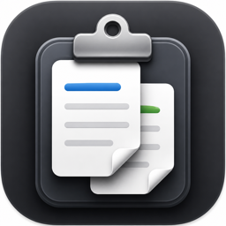
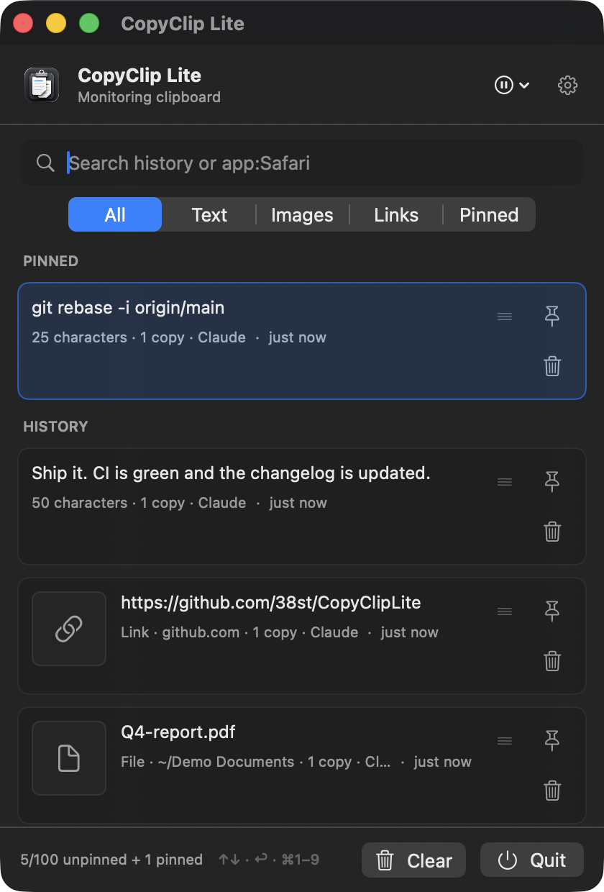
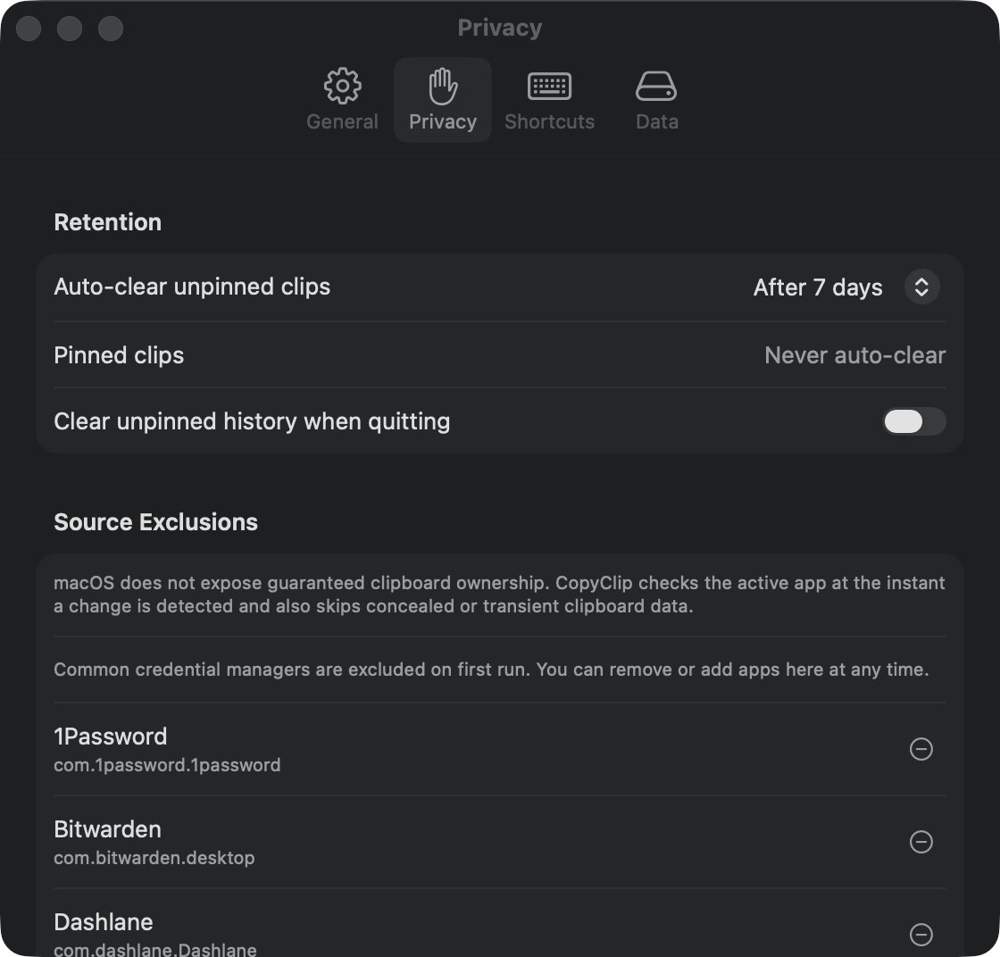

<div align="center">



# CopyClip Lite

**Clipboard history for macOS. Local, native, out of the way.**

A menu-bar app that remembers what you copy and gives it back with a keystroke.
No account, no sync, no analytics — your clipboard never leaves your Mac.

[](https://github.com/38st/CopyClipLite/actions/workflows/ci.yml)
[](https://github.com/38st/CopyClipLite/releases/latest)
[](#requirements)
[](#requirements)
[](LICENSE)

<br>



</div>

---

## Install

**Download it**

Grab `CopyClip-Lite-macOS.zip` from the [latest release](https://github.com/38st/CopyClipLite/releases/latest),
unzip, and drag **CopyClip Lite.app** into Applications.

Releases are ad-hoc signed rather than notarized, so the first launch needs one extra step:
Control-click the app, choose **Open**, then confirm.

**Or build it**

```bash
git clone https://github.com/38st/CopyClipLite.git
cd CopyClipLite
./script/install_app.sh
```

Builds a universal bundle, installs it to `/Applications/CopyClip Lite.app`, refreshes the
LaunchServices and Quick Look caches, and opens it.

---

## Using it

Press <kbd>⌥</kbd><kbd>⌘</kbd><kbd>V</kbd> anywhere, or click the clipboard in your menu bar.
Type to search, arrow to what you want, press <kbd>Return</kbd>.

| Shortcut | Action |
|---|---|
| <kbd>⌥</kbd><kbd>⌘</kbd><kbd>V</kbd> | Open clipboard search — rebindable in Settings |
| <kbd>↑</kbd> <kbd>↓</kbd> | Move through the list |
| <kbd>Return</kbd> | Use the selected clip |
| <kbd>⌘</kbd><kbd>1</kbd>–<kbd>⌘</kbd><kbd>9</kbd> | Jump straight to one of the first nine clips |
| <kbd>⇧</kbd><kbd>⌘</kbd><kbd>V</kbd> | Copy as plain text, dropping all formatting |
| <kbd>⌘</kbd><kbd>F</kbd> | Focus search |
| <kbd>⌘</kbd><kbd>P</kbd> | Pin or unpin |
| <kbd>⌘</kbd><kbd>⌫</kbd> | Delete |

<kbd>⇧</kbd>-click a range or <kbd>⌘</kbd>-click to toggle rows, then pin, unpin or delete the whole
selection at once. Drag any row straight into another app — text lands as text, images as PNG files.

**Search scoping** — type `app:safari invoice` to search only clips that came from Safari. A plain
query still searches everything.

**Filters** narrow the list to text, images, files and links, or just your pinned clips.

---

## What it captures

| | |
|---|---|
| **Text** | Plain text, plus RTF and HTML when the source provides them |
| **Images** | PNG, TIFF, JPEG, HEIC/HEIF, and images copied in Finder — normalized to PNG |
| **Files** | Copy a file in Finder and it stays a file: paste it back into Finder, or drag it straight out |
| **Links** | URLs are kept as links, showing the host rather than a wall of query string |
| **Context** | Which app a clip came from, when it was last used, how often |

**Pins** keep a clip out of the auto-clear rotation until you remove it yourself. Pinned clips sit at
the top and never expire.

**Transform & Copy** rewrites a text clip on the way out — uppercase, lowercase, or title case.

**Pause** monitoring for five minutes, an hour, or until tomorrow.

**Import and export** history as JSON, with a validated preview showing exactly what a merge or
replace would do before you commit to it, and an automatic backup taken first.

---

## Privacy

This is the part that matters for a clipboard manager, so here it is in full.



- **Nothing leaves your Mac.** No account, no telemetry, and no network access at all except the
  explicit "Check for Updates" button. `URLSession` appears in exactly one file in the whole project.
- **Concealed data is skipped.** Clips the source app marks transient, concealed, or auto-generated
  — which is how password managers mark theirs — are never recorded.
- **Password managers are excluded out of the box.** On first run the ignore list is seeded with
  1Password, Bitwarden, KeePassXC, Keeper, Dashlane, LastPass, Proton Pass, and Apple's Passwords
  app. Every entry is visible and editable, and one you remove stays removed.
- **Per-app exclusions.** Add any app and its clips are dropped. Best effort: macOS does not expose
  guaranteed clipboard ownership, so CopyClip checks the frontmost app both while polling and
  immediately before an app switch is recorded.
- **Owner-only files.** History is `0600` inside a `0700` directory. It is *not* separately
  encrypted — turn on FileVault if clipboard confidentiality matters to you.
- **Exports are plaintext.** A JSON export contains everything, images included, unencrypted. The app
  warns you before writing one.
- **Deleting means deleting.** Clearing history also purges the automatic pre-import backups, so
  cleared content does not survive in a file you never see. Settings → Data shows how many backups
  exist, how much space they use, and lets you delete them outright.

Everything lives here:

```text
~/Library/Application Support/CopyClipLite/
├── clipboard-history.json                 # the history itself
├── Images/                                # image clips, one PNG each
└── clipboard-history.pre-import-*.json    # automatic pre-import backups, capped at 5
```

Defaults: 50 unpinned clips, auto-cleared after 7 days. Both are configurable, and both warn you with
an exact count before deleting anything.

<details>
<summary><strong>Size limits</strong> — what gets downscaled, and what gets skipped</summary>

<br>

Unbounded clipboard data can freeze a UI or fill a disk, so CopyClip Lite bounds what it stores and
tells you when something was refused.

| | |
|---|---|
| Text | Skipped over 20,000 characters |
| Image input | Skipped over 30 MB, or 16,384 px on either side |
| Image output | Downscaled proportionally into roughly a 16.8-megapixel budget |
| Stored image | Skipped if the encoded PNG still exceeds 10 MB |
| RTF / HTML | 10 MB each, per clip |

An ordinary large photo is downscaled rather than refused. Rich text is kept only when a plain-text
version can also be extracted. Image copy-back writes PNG and lets macOS synthesize other
representations on demand, rather than decoding a TIFF on the main thread.

</details>

---

## Requirements

- macOS 14 Sonoma or later
- Apple silicon or Intel — releases are universal
- Accessibility permission **only** if you enable Direct Paste, the optional mode that pastes
  straight back into the app you came from

---

## Development

```bash
swift test                 # the full suite
./script/build_and_run.sh  # build, stage the .app, launch it
```

The complete local validation set, which is what CI runs on every pull request:

```bash
swift test
swift build -Xswiftc -strict-concurrency=complete -Xswiftc -warnings-as-errors
./script/check_coverage.sh                      # needs jq
./script/tests/installer_process_harness.sh
bash ./script/tests/release_contract_harness.sh
```

`check_coverage.sh` enforces per-file and per-group line-coverage floors, not just one global number.
See [CONTRIBUTING.md](CONTRIBUTING.md) for the workflow and
[the accessibility matrix](docs/accessibility-testing.md) for the manual VoiceOver and Reduce Motion
checks each release needs.

<details>
<summary><strong>Releases and signing</strong></summary>

<br>

```bash
./script/package_release.sh
```

Builds an ad-hoc signed universal bundle, validates the plist and signature, writes
`dist/CopyClip-Lite-macOS.zip`, reproduces that ZIP byte-for-byte from the staged app, verifies it,
launch-smoke-tests a fresh extraction, and reports the expected Gatekeeper assessment.

This project has no Apple Developer Program account, so releases are ad-hoc signed rather than
Developer ID signed and notarized. The packaging script still supports Developer ID distribution for
a future maintainer who has one.

Versions use `X.Y.Z` and tags use `vX.Y.Z`. The tagged-release workflow runs the same verification,
creates a draft, downloads the uploaded ZIP, checks its SHA-256 against the locally verified
artifact, and only then publishes.

Source builds and releases both check for updates against the public GitHub Releases endpoint;
maintainers can point that elsewhere with `COPYCLIP_UPDATE_FEED_URL`.

The bundle identifier is `io.github.38st.CopyClipLite`. Upgrading from the old local identifier
migrates preferences automatically; history stays where it is.

</details>

---

## License

[MIT](LICENSE). Security reports go through [SECURITY.md](SECURITY.md) rather than the public issue
tracker — please don't put real clipboard contents in an issue.
